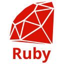

# Amrit

I'm a full-stack dev and I live mostly in the backend.

Currently working with:

  
  
  

  
  
  
  
  

  
  
  

  
  
  

  

---

### 🛠️ Recent Projects

#### 🎓 [CCHive](https://github.com/amrxt1/cchive_frontend)

> Built a full-stack community app with user auth, real-time study groups, course reviews, and chat.

- Secure API backend with Rails + Devise token auth
- Role-based frontend in React with protected routes
- Real-time messaging via ActionCable

---

### Contact

- **Email**: amritv.dev@proton.me
- **Location**: Surrey, BC
